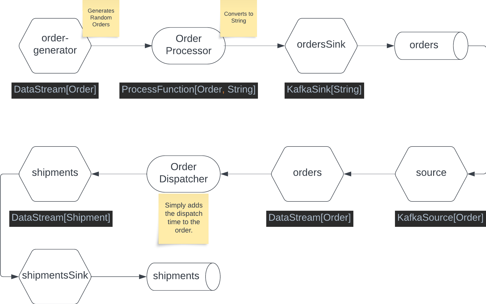

## Flink Kafka Scala Sample Stream

A simple Flink Streaming Scala application communicating via Kafka topics. 
Not that this application uses an embedded Flink cluster. 
It currently cannot be configured to run with a Flink cluster on Confluent Cloud.

### Features 
* Works with Confluent Cloud or any simple Kafka cluster
* Native Scala Dependency Injection for better testablility and environment support. 
* Directly uses the Flink Java Streaming API.

### Overview Diagram

### Running the App

#### Prerequisites

* A recent version of Apache Maven installed
* Confluent Platform installed for running locally
* A Confluent Cloud Account for running on Confluent Cloud
* Java 11
* Linux or Mac environment for running the start scripts. 

#### Running Locally

For running with a local cluster, start the `LocalApp` class from within your IDE.
* This class expects a Kafka broker listening on `localhost:9092` without authentication and authorization
* Topics will be auto-created when the app is started. 
  * You may need to start the app twice.
* No need to set environment variables
* Alternatively, you can run the `script-local.sh` on a Mac. 
  * You may need to set the `JAVA_HOME` environment variable appropriately. 

#### Running with Confluent Cloud

For running with a Kafka Cluster in Confluent Cloud, follow these steps:
* Create the topics `flink-orders` and `flink-shipments`.
* Create an API Key and API Secret for Confluent Cloud
* Set the following environment variables: 
  * `BOOTSTRAP_SERVERS=pkc-...confluent.cloud:9092`
  * `SASL_JAAS_CONFIG=org.apache.kafka.common.security.plain.PlainLoginModule required username='<YOUR_API_KEY>' password='<YOUR_PASSWORD>';`
* Then run the class `ConfluentCloudApp` from within your IDE
* Alternatively, run the script `run-on-confluent-cloud.sh`. 
  * This script expects the environment variables shown in `sample.env`.

